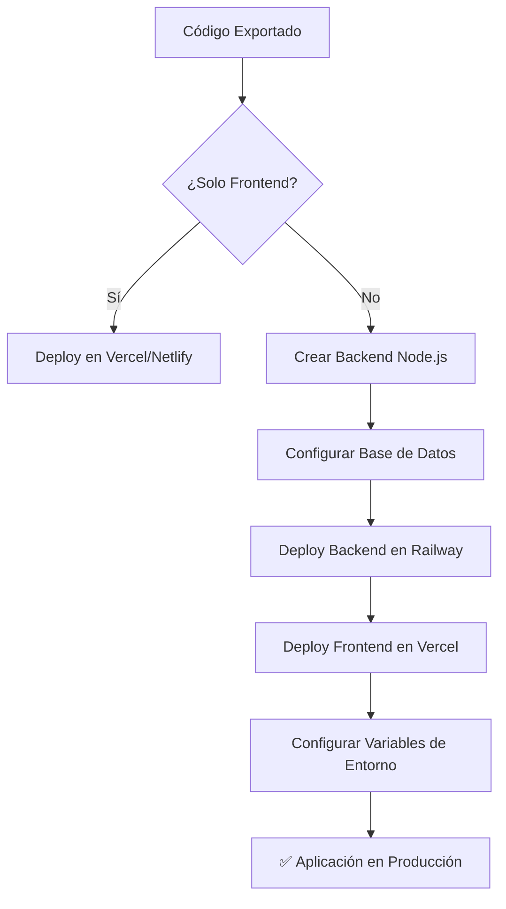

# 🚀 Guía de Deployment - Sistema de Gastos y Quinielas

## 📋 Lista de Verificación Pre-Deployment

### ✅ Frontend Ready
- [x] Código React/TypeScript completo
- [x] Componentes UI (shadcn) incluidos
- [x] ApiService configurado para backend
- [x] Estilos Tailwind V4 personalizados
- [x] Tipos TypeScript definidos
- [x] Package.json con dependencias
- [x] Configuración Vite/Tailwind

### ⚠️ Backend Pendiente
- [ ] Servidor Node.js/Express
- [ ] Base de datos MySQL/PostgreSQL
- [ ] APIs REST implementadas
- [ ] Sistema de autenticación JWT
- [ ] Configuración de email

---

## 🌐 Opciones de Deployment

### 1. **Frontend (Vercel - Recomendado)**

```bash
# 1. Instalar Vercel CLI
npm i -g vercel

# 2. Desde el directorio del proyecto
npm run build
vercel

# 3. Seguir las instrucciones interactivas
# - Conectar con GitHub
# - Configurar dominio personalizado
# - Variables de entorno para producción
```

**Variables de entorno en Vercel:**
- `VITE_API_URL`: URL de tu backend (ej: `https://tu-backend.railway.app/api`)

### 2. **Backend (Railway - Recomendado)**

```bash
# 1. Crear proyecto backend según la estructura mencionada
# 2. Subir a GitHub
# 3. Conectar Railway con tu repositorio
# 4. Configurar variables de entorno en Railway:

DB_HOST=tu-host-railway
DB_PORT=5432
DB_NAME=railway
DB_USER=postgres
DB_PASSWORD=auto-generada-por-railway
JWT_SECRET=tu-clave-secreta-super-larga
SMTP_HOST=smtp.gmail.com
SMTP_PORT=587
SMTP_USER=tu-email@gmail.com
SMTP_PASS=tu-app-password
FRONTEND_URL=https://tu-frontend.vercel.app
```

### 3. **Base de Datos (Railway PostgreSQL)**

Railway proporciona PostgreSQL gratuito con tu backend. Ejecutar el esquema desde `/database-schema.md`.

---

## 🔧 Configuración Local Rápida

### Opción A: Solo Frontend (Mock Data)
```bash
# El frontend actual funciona con datos simulados
npm install
npm run dev
# ✅ Listo - Aplicación funcional con datos de prueba
```

### Opción B: Frontend + Backend Completo
```bash
# 1. Frontend
npm install
npm run build  # Para producción

# 2. Backend (crear carpeta separada)
mkdir ../backend && cd ../backend
npm init -y
# Instalar dependencias según la guía del README.md
# Implementar controllers/routes/models según ApiService

# 3. Base de datos
# Crear BD MySQL/PostgreSQL
# Ejecutar esquema desde database-schema.md
```

---

## 📊 Flujo de Deployment Completo



---

## 🎯 Configuración Específica por Plataforma

### **Vercel (Frontend)**
```json
// vercel.json
{
  "buildCommand": "npm run build",
  "outputDirectory": "dist",
  "framework": "vite",
  "env": {
    "VITE_API_URL": "https://tu-backend.railway.app/api"
  }
}
```

### **Railway (Backend)**
```json
// railway.json
{
  "build": {
    "builder": "NIXPACKS"
  },
  "deploy": {
    "startCommand": "npm start",
    "restartPolicyType": "ON_FAILURE"
  }
}
```

### **Netlify (Alternativa Frontend)**
```toml
# netlify.toml
[build]
  command = "npm run build"
  publish = "dist"

[[redirects]]
  from = "/*"
  to = "/index.html"
  status = 200
```

---

## 🔐 Configuración de Seguridad

### Variables de Entorno Críticas
```bash
# Backend
JWT_SECRET=clave-super-segura-de-minimo-32-caracteres
DB_PASSWORD=contraseña-compleja-autogenerada
SMTP_PASS=app-password-de-gmail-no-contraseña-normal

# Frontend
VITE_API_URL=https://tu-backend-seguro.com/api
```

### Headers de Seguridad (Backend)
```javascript
// Ya incluido en la configuración propuesta
app.use(helmet());
app.use(cors({
  origin: process.env.FRONTEND_URL,
  credentials: true
}));
```

---

## 📈 Monitoreo y Logs

### Logs de Producción
```bash
# Railway logs en tiempo real
railway logs --follow

# Vercel logs
vercel logs tu-deployment-url
```

### Métricas Importantes
- **Tiempo de respuesta API**: < 200ms promedio
- **Uptime**: > 99.9%
- **Errores 5xx**: < 0.1%
- **Tiempo de carga frontend**: < 2s

---

## 🆘 Solución de Problemas Comunes

### Error: "Cannot connect to backend"
```bash
# Verificar variables de entorno
echo $VITE_API_URL

# Verificar que backend esté corriendo
curl https://tu-backend.com/api/health
```

### Error: "Database connection failed"
```bash
# Verificar conexión a BD
# En Railway: Ver logs de deployment
# Verificar que las variables DB_* estén correctas
```

### Error de CORS
```javascript
// Verificar configuración CORS en backend
app.use(cors({
  origin: ["https://tu-frontend.vercel.app", "http://localhost:3000"],
  credentials: true
}));
```

---

## 🎉 ¡Tu Aplicación Está Lista!

Una vez completado el deployment, tendrás:

✅ **Frontend**: Aplicación React optimizada en Vercel  
✅ **Backend**: APIs Node.js seguras en Railway  
✅ **Base de Datos**: PostgreSQL administrada  
✅ **Dominio**: HTTPS automático  
✅ **Monitoreo**: Logs y métricas en tiempo real  

**URL Final**: `https://tu-dominio-personalizado.com`

---

## 📞 Soporte Post-Deployment

- **Logs**: Accessible desde dashboard de Railway/Vercel
- **Backups**: Automáticos en Railway PostgreSQL
- **Escalado**: Automático según tráfico
- **SSL**: Renovación automática
- **CDN**: Global via Vercel Edge Network